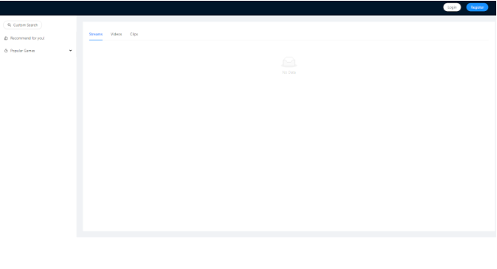
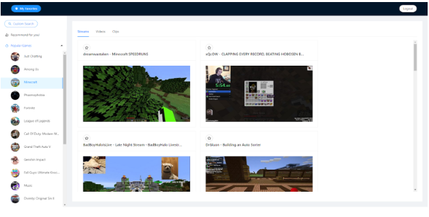
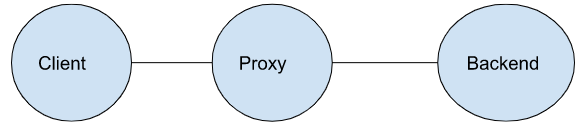
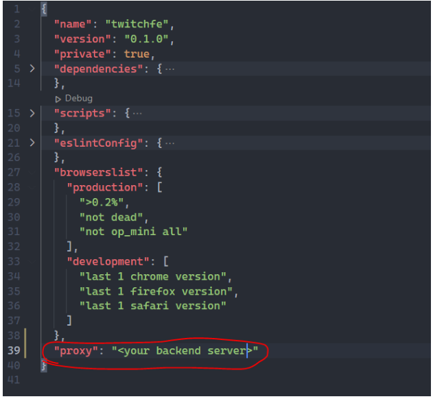

# Lesson 1 Twitch Client 1

Final Code: [GitHub Repo](https://github.com/laecheng/twitchfe)

A quick look at how the final app look





## Client - Server communication

AJAX - communicate with server

<https://developer.mozilla.org/en-US/docs/Web/API/Fetch_API>

Proxy Setup



In twitchfe/package.json



## Create a file to group all the util methods

We will define all the “helper” functions here, to be more specific, all the code that makes http requests from our client to server will live here.

Create a file at this path, /src/utils.js 

```Javascript
const SERVER_ORIGIN = '';
 
const loginUrl = `${SERVER_ORIGIN}/login`;
 
export const login = (credential) => {
  return fetch(loginUrl, {
    method: 'POST',
    headers: {
      'Content-Type': 'application/json',
    },
    credentials: 'include',
    body: JSON.stringify(credential)
  }).then((response) => {
    if (response.status !== 200) {
      throw Error('Fail to log in');
    }
 
    return response.json();
  })
}
 
const registerUrl = `${SERVER_ORIGIN}/register`;
 
export const register = (data) => {
  return fetch(registerUrl, {
    method: 'POST',
    headers: {
      'Content-Type': 'application/json',
    },
    body: JSON.stringify(data)
  }).then((response) => {
    if (response.status !== 200) {
      throw Error('Fail to register');
    }
  })
}
 
const logoutUrl = `${SERVER_ORIGIN}/logout`;
 
export const logout = () => {
  return fetch(logoutUrl, {
    method: 'POST',
    credentials: 'include',
  }).then((response) => {
    if (response.status !== 200) {
      throw Error('Fail to log out');
    }
  })
}
 
const topGamesUrl = `${SERVER_ORIGIN}/game`;
 
export const getTopGames = () => {
  return fetch(topGamesUrl).then((response) => {
    if (response.status !== 200) {
      throw Error('Fail to get top games');
    }
 
    return response.json();
  })
}
 
const getGameDetailsUrl = `${SERVER_ORIGIN}/game?game_name=`;
 
const getGameDetails = (gameName) => {
  return fetch(`${getGameDetailsUrl}${gameName}`).then((response) => {
    if (response.status !== 200) {
      throw Error('Fail to find the game');
    }
 
    return response.json();
  });
}
 
const searchGameByIdUrl = `${SERVER_ORIGIN}/search?game_id=`;
 
export const searchGameById = (gameId) => {
  return fetch(`${searchGameByIdUrl}${gameId}`).then((response) => {
    if (response.status !== 200) {
      throw Error('Fail to find the game');
    }
    return response.json();
  })
}
 
export const searchGameByName = (gameName) => {
  return getGameDetails(gameName).then((data) => {
    if (data && data.id) {
      return searchGameById(data.id);
    }
 
    throw Error('Fail to find the game')
  })
}
 
const favoriteItemUrl = `${SERVER_ORIGIN}/favorite`;
 
export const addFavoriteItem = (favItem) => {
  return fetch(favoriteItemUrl, {
    method: 'POST',
    headers: {
      'Content-Type': 'application/json',
    },
    credentials: 'include',
    body: JSON.stringify({ favorite: favItem })
  }).then((response) => {
    if (response.status !== 200) {
      throw Error('Fail to add favorite item');
    }
  })
}
 
export const deleteFavoriteItem = (favItem) => {
  return fetch(favoriteItemUrl, {
    method: 'DELETE',
    headers: {
      'Content-Type': 'application/json',
    },
    credentials: 'include',
    body: JSON.stringify({ favorite: favItem })
  }).then((response) => {
    if (response.status !== 200) {
      throw Error('Fail to delete favorite item');
    }
  })
}
 
export const getFavoriteItem = () => {
  return fetch(favoriteItemUrl, {
    credentials: 'include',
  }).then((response) => {
    if (response.status !== 200) {
      throw Error('Fail to get favorite item');
    }
 
    return response.json();
  })
}
 
const getRecommendedItemsUrl = `${SERVER_ORIGIN}/recommendation`;
 
export const getRecommendations = () => {
  return fetch(getRecommendedItemsUrl, {
    credentials: 'include',
  }).then((response) => {
    if (response.status !== 200) {
      throw Error('Fail to get recommended item');
    }
 
    return response.json();
  })
}

```

## Build the skeleton of the app

We can find what we need here [Ant Design - Layout](https://ant.design/components/layout/#header)

Install antd: Command line run ‘npm add antd’, then

- Delete the whole src/App.css file, we won’t need it
- Remove everything but the first line in src/index.css file, so it only has

```Javascript
@import '~antd/dist/antd.css';
```

Use what we found on Ant Design’s doc on src/App.js (Override the whole file)

Notice the ‘Header’, ‘Sider’, ‘Home’ placeholder, which we will implement one by one.

```Javascript
import React from 'react';
import { Layout } from 'antd';
 
const { Header, Content, Sider } = Layout;
 
function App() {
  return (
    <Layout>
      <Header>
        {'Header'}
      </Header>
      <Layout>
        <Sider width={300} className="site-layout-background">
          {'Sider'}
        </Sider>
        <Layout style={{ padding: '24px' }}>
          <Content
            className="site-layout-background"
            style={{
              padding: 24,
              margin: 0,
              height: 800,
              overflow: 'auto'
            }}
          >
            {'Home'}
          </Content>
        </Layout>
      </Layout>
    </Layout>
  )
}
 
export default App;
```

Then we update the styles
src/index.css

```Javascript
@import '~antd/dist/antd.css';
 
.site-layout-background {
  background: #fff;
}
 
.site-top-game-list ul {
  max-height: 700px;
  overflow-y: auto;
  overflow-x: hidden;
}

```

## Build login, register and logout

- When user hasn’t yet logged in, we only display login and register button on the header
- After user successfully logged in, we only display logout on the header
- We need a state to store user’s login status

src/components/Login.js (This component will take care of the login flow)

```Javascript
import { Button, Form, Input, message, Modal } from 'antd'
import React, { useState } from 'react';
import { LockOutlined, UserOutlined } from '@ant-design/icons';
import { login } from '../utils'
 
function Login({ onSuccess }) {
  const [displayModal, setDisplayModal] = useState(false)
 
  const handleCancel = () => {
    setDisplayModal(false)
  }
 
  const signinOnClick = () => {
    setDisplayModal(true)
  }
 
  const onFinish = (data) => {
    login(data)
      .then((data) => {
        setDisplayModal(false)
        message.success(`Welcome back, ${data.name}`)
        onSuccess()
      }).catch((err) => {
        message.error(err.message)
      })
  }
 
  return (
    <>
      <Button shape="round" onClick={signinOnClick} style={{ marginRight: '20px' }}>
        Login
      </Button>
      <Modal
        title="Log in"
        visible={displayModal}
        onCancel={handleCancel}
        footer={null}
        destroyOnClose={true}
      >
        <Form
          name="normal_login"
          onFinish={onFinish}
          preserve={false}
        >
          <Form.Item
            name="user_id"
            rules={[{ required: true, message: 'Please input your Username!' }]}
          >
            <Input prefix={<UserOutlined />} placeholder="Username" />
          </Form.Item>
          <Form.Item
            name="password"
            rules={[{ required: true, message: 'Please input your Password!' }]}
          >
            <Input.Password
              prefix={<LockOutlined />}
              placeholder="Password"
            />
          </Form.Item>
          <Form.Item>
            <Button type="primary" htmlType="submit">
              Login
            </Button>
          </Form.Item>
        </Form>
      </Modal>
    </>
  )
}
 
export default Login
```

Then we build a component for register.

src/components/Register.js

```Javascript
import { Button, Form, Input, message, Modal } from 'antd';
import React, { useState } from 'react';
import { LockOutlined, UserOutlined } from '@ant-design/icons';
import { register } from '../utils';
 
function Register() {
  const [displayModal, setDisplayModal] = useState(false)
 
  const handleCancel = () => {
    setDisplayModal(false)
  }
 
  const signupOnClick = () => {
    setDisplayModal(true)
  }
 
  const onFinish = (data) => {
    register(data)
      .then(() => {
        setDisplayModal(false)
        message.success('Successfully signed up');
      }).catch((err) => {
        message.error(err.message);
      })
  }
 
  return (
    <>
      <Button shape="round" type="primary" onClick={signupOnClick}>
        Register</Button>
      <Modal
        title="Register"
        visible={displayModal}
        onCancel={handleCancel}
        footer={null}
        destroyOnClose={true}
      >
        <Form
          name="normal_register"
          initialValues={{ remember: true }}
          onFinish={onFinish}
          preserve={false}
        >
          <Form.Item
            name="user_id"
            rules={[{ required: true, message: 'Please input your Username!' }]}
          >
            <Input prefix={<UserOutlined />} placeholder="Username" />
          </Form.Item>
          <Form.Item
            name="password"
            rules={[{ required: true, message: 'Please input your Password!' }]}
          >
            <Input
              prefix={<LockOutlined />}
              placeholder="Password"
            />
          </Form.Item>
          <Form.Item
            name="first_name"
            rules={[{ required: true, message: 'Please input your Firstname!' }]}
          >
            <Input
              placeholder="firstname"
            />
          </Form.Item>
          <Form.Item
            name="last_name"
            rules={[{ required: true, message: 'Please input your Lastname!' }]}
          >
            <Input
              placeholder="lastname"
            />
          </Form.Item>
          <Form.Item>
            <Button type="primary" htmlType="submit">
              Register
            </Button>
          </Form.Item>
        </Form>
      </Modal>
    </>
  )
}
 
export default Register;
```